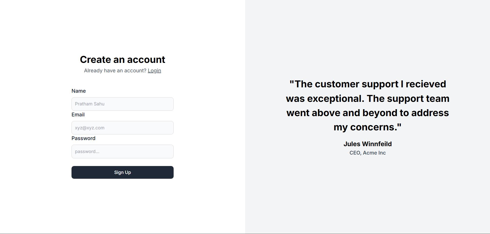
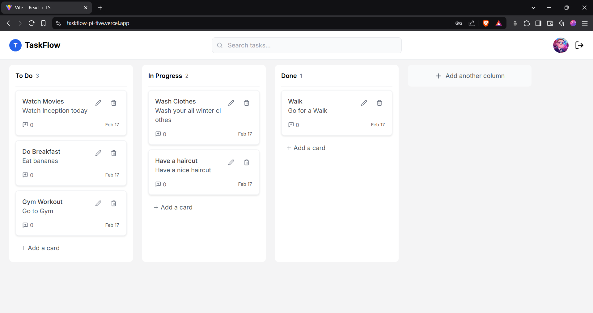

# Interactive Taskflow Board

## Overview
The **Interactive Taskflow Board** is a lightweight task management application built with React and TypeScript, Node.js, PostgreSQL. It allows users to create, edit, delete, and organize tasks into different columns using drag-and-drop functionality. The project uses **localStorage** for data persistence and includes additional features like task filtering, undo delete, dynamic column addition, and task comments.

### Visit website - https://taskflow-pi-five.vercel.app

## Demo
<video controls src="https://www.loom.com/embed/3416f167959b43b68b7bef45664a0e6f?sid=5070b478-a8fb-49e2-a788-ae60b006943d" title="Title"></video>

https://www.loom.com/share/3416f167959b43b68b7bef45664a0e6f?sid=cecc5039-0a79-4f35-8a07-48b3febb016e


## ScreenShots

### SignUp Page


### Main page


## Features
### Task Management
- Three default columns: **To Do**, **In Progress**, and **Done**.
- Users can **add, edit, and delete** tasks.
- Each task contains a **title and description**.
- Tasks are **draggable** between columns.
- Users can **add new columns** dynamically.
- **Search filter** to find tasks by title.
- **Task comments** for better task tracking.
- **Added Authenticaton**

### Drag & Drop
- I have built Drag and Drop feature using native browser API.

### Data Persistence
- Tasks are **saved in localStorage** to persist after a page refresh.

### UI/UX
- **Responsive design** for desktop and mobile.
- Nice UI

## Tech Stack
- **React.js** (with Context API for state management)
- **TypeScript**
- **Vanilla CSS**
- **Node.js**
- **Express.js** 
- **PostgreSQL** 
- **Prisma ORM** 

## Installation
1. Clone the repository:
   ```bash
   git clone https://github.com/your-username/kanban-board.git
   cd kanban-board
   ```
2. Install dependencies:
   ```bash
   npm install
   ```
3. Run the development server:
   ```bash
   npm start
   ```
4. Open the app in the browser at:
   ```
   http://localhost:3000
   ```

## Usage
- Click **Add Task** to create a new task.
- Drag tasks between columns to update their status.
- Click on a task to **edit** or **delete** it.
- Use the **search bar** to find tasks by title.
- Click **Add Column** to add a new workflow column.
